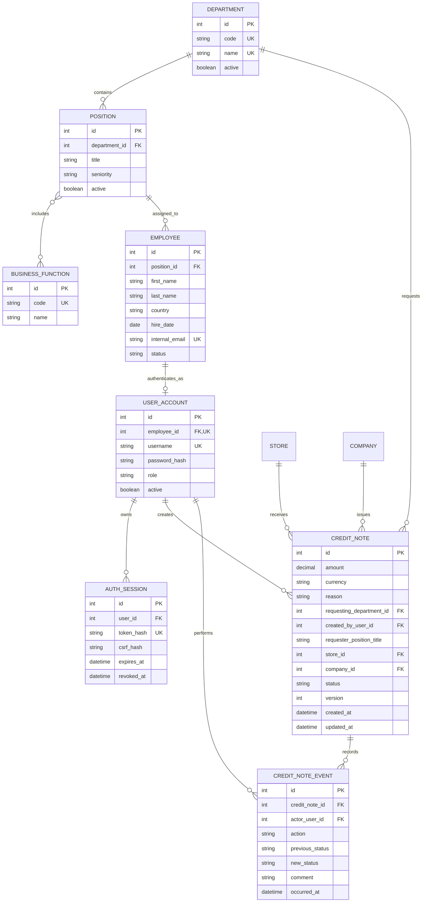

# Modelo relacional propuesto

El departamento del colaborador se obtiene por `employee → position → department`, evitando duplicarlo en varias tablas. La nota conserva su departamento solicitante y el título del cargo como instantáneas históricas; así, un cambio organizacional posterior no modifica retrospectivamente la analítica de la solicitud.
